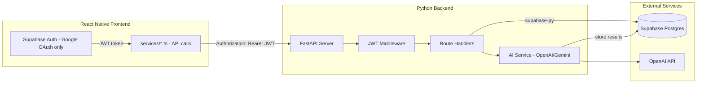

# Python FastAPI Backend for Zuno

## Architecture



## Auth Flow (Google OAuth only -- phone OTP removed)

- Frontend uses Supabase Auth **only** for Google OAuth (`signInWithOAuth`), `signOut`, and `getSession`
- Phone OTP (`sendOTP`, `verifyOTP`) is removed entirely -- the `verify.tsx` screen and related code are deleted
- After Google sign-in, Supabase issues a JWT; frontend sends it as `Authorization: Bearer <token>` header to every Python API call
- Python backend validates the JWT using Supabase's JWT secret (from `SUPABASE_JWT_SECRET`) and extracts `user.id`
- No session/cookie management on the Python side -- it's fully stateless

## Backend Directory Structure

```
backend/
├── app/
│   ├── __init__.py
│   ├── main.py                 # FastAPI app, CORS, router includes
│   ├── config.py               # Pydantic Settings (env vars)
│   ├── dependencies.py         # get_current_user(), get_supabase()
│   ├── routers/
│   │   ├── __init__.py
│   │   ├── profile.py          # GET/PATCH /profile
│   │   ├── collections.py      # CRUD /collections + /collections/{id}/items
│   │   ├── content.py          # CRUD /content + /content/{id}/tags
│   │   ├── feed.py             # GET /feed, bookmarks toggle
│   │   ├── search.py           # FTS, hybrid, tag search, popular tags
│   │   └── ai.py               # process-content, generate-embedding, generate-feed
│   ├── services/
│   │   ├── __init__.py
│   │   ├── openai_service.py   # OpenAI categorize/summarize/embed
│   │   ├── metadata_service.py # URL metadata scraping (OG tags)
│   │   └── feed_generator.py   # AI + rule-based feed generation
│   └── schemas/
│       ├── __init__.py
│       └── models.py           # Pydantic request/response models
├── requirements.txt
├── .env.example
└── README.md
```

## API Endpoints (25 total)

### Profile (from [services/auth.service.ts](services/auth.service.ts))

- `GET /api/profile` -- get current user's profile
- `PATCH /api/profile` -- update display_name, avatar_url

### Collections (from [services/collections.service.ts](services/collections.service.ts))

- `GET /api/collections` -- list user's collections
- `GET /api/collections/{id}` -- get single collection
- `POST /api/collections` -- create collection
- `PATCH /api/collections/{id}` -- update collection
- `DELETE /api/collections/{id}` -- delete collection
- `GET /api/collections/{id}/items` -- get items in collection (with content join)
- `POST /api/collections/{id}/items` -- add content to collection (+ increment count RPC)
- `DELETE /api/collections/{id}/items/{content_id}` -- remove from collection (+ decrement count RPC)

### Content (from [services/content.service.ts](services/content.service.ts))

- `GET /api/content` -- list content (query params: limit, offset, category, platform, content_type)
- `GET /api/content/{id}` -- get single content
- `POST /api/content` -- save new content (auto-sets user_id from JWT)
- `PATCH /api/content/{id}` -- update content
- `DELETE /api/content/{id}` -- delete content
- `GET /api/content/{id}/tags` -- get content with joined tags

### Feed (from [services/feed.service.ts](services/feed.service.ts))

- `GET /api/feed` -- get feed items (query params: limit, offset, category, content_type)
- `GET /api/bookmarks` -- get user's bookmarked feed_item_ids
- `POST /api/bookmarks/{feed_item_id}/toggle` -- toggle bookmark on/off

### Search (from [services/search.service.ts](services/search.service.ts))

- `GET /api/search?q={query}&limit={n}` -- full-text search (calls `search_content` RPC)
- `GET /api/search/hybrid?q={query}&limit={n}` -- hybrid search (generates embedding, calls `hybrid_search` RPC)
- `GET /api/search/tag/{slug}?limit={n}` -- tag-based search (calls `search_by_tag` RPC)
- `GET /api/tags/popular?limit={n}` -- popular tags by usage_count

### AI Processing (replaces all 3 Edge Functions)

- `POST /api/ai/process-content` -- replaces `supabase/functions/process-content/` -- accepts `{content_id}`, scrapes URL metadata, calls OpenAI for categorization/summary/tags/embedding, updates DB, updates user_interests
- `POST /api/ai/generate-embedding` -- replaces `supabase/functions/generate-embedding/` -- accepts `{text}`, returns embedding vector
- `POST /api/ai/generate-feed` -- replaces `supabase/functions/generate-feed/` -- reads user_interests, generates AI-powered feed recommendations, upserts feed_items

## Key Implementation Details

### Auth Middleware (`dependencies.py`)

- Use `python-jose` to decode the Supabase JWT
- JWT secret comes from `SUPABASE_JWT_SECRET` env var (found in Supabase Dashboard -> Settings -> API -> JWT Secret)
- Returns `user_id` string for every protected endpoint via `Depends(get_current_user)`

### Supabase Client (`dependencies.py`)

- Use `supabase-py` initialized with `SUPABASE_URL` + `SUPABASE_SERVICE_ROLE_KEY` (service role to bypass RLS since auth is handled at the Python layer)
- Single shared client instance

### AI Service (`services/openai_service.py`)

- Port the OpenAI logic from [supabase/functions/process-content/index.ts](supabase/functions/process-content/index.ts) lines 183-241
- Uses `httpx` or `openai` Python SDK for API calls
- Supports both OpenAI and Gemini providers (same as current Edge Function)

### Frontend Changes

- Update all 5 files in `services/` to call `BACKEND_URL/api/...` instead of `supabase.from(...)` directly
- Add `EXPO_PUBLIC_BACKEND_URL` env var
- Keep [lib/supabase.ts](lib/supabase.ts) for auth-only usage (Google OAuth, signOut, session management)
- Keep [stores/authStore.ts](stores/authStore.ts) largely the same but fetch profile from Python API
- Remove phone OTP: delete `sendOTP()` and `verifyOTP()` from [services/auth.service.ts](services/auth.service.ts)
- Remove or repurpose [app/(auth)/verify.tsx](app/\\(auth)/verify.tsx) (no longer needed without OTP)
- Simplify [app/(auth)/login.tsx](app/\\(auth)/login.tsx) to show only "Sign in with Google" button

## Dependencies (`requirements.txt`)

- `fastapi` -- web framework
- `uvicorn[standard]` -- ASGI server
- `supabase` -- supabase-py SDK
- `python-jose[cryptography]` -- JWT decoding
- `pydantic-settings` -- env var management
- `httpx` -- async HTTP client (for OpenAI calls + URL metadata scraping)
- `beautifulsoup4` -- HTML parsing for OG metadata extraction
- `python-dotenv` -- .env file loading
- `openai` -- OpenAI Python SDK (optional, can use httpx directly)

## Environment Variables (`backend/.env.example`)

- `SUPABASE_URL` -- same as frontend
- `SUPABASE_SERVICE_ROLE_KEY` -- from Dashboard -> Settings -> API (secret, never expose to frontend)
- `SUPABASE_JWT_SECRET` -- from Dashboard -> Settings -> API -> JWT Secret
- `OPENAI_API_KEY` -- for AI features
- `GEMINI_API_KEY` -- optional, for Gemini provider
- `BACKEND_PORT` -- default 8000
- `CORS_ORIGINS` -- allowed origins for CORS