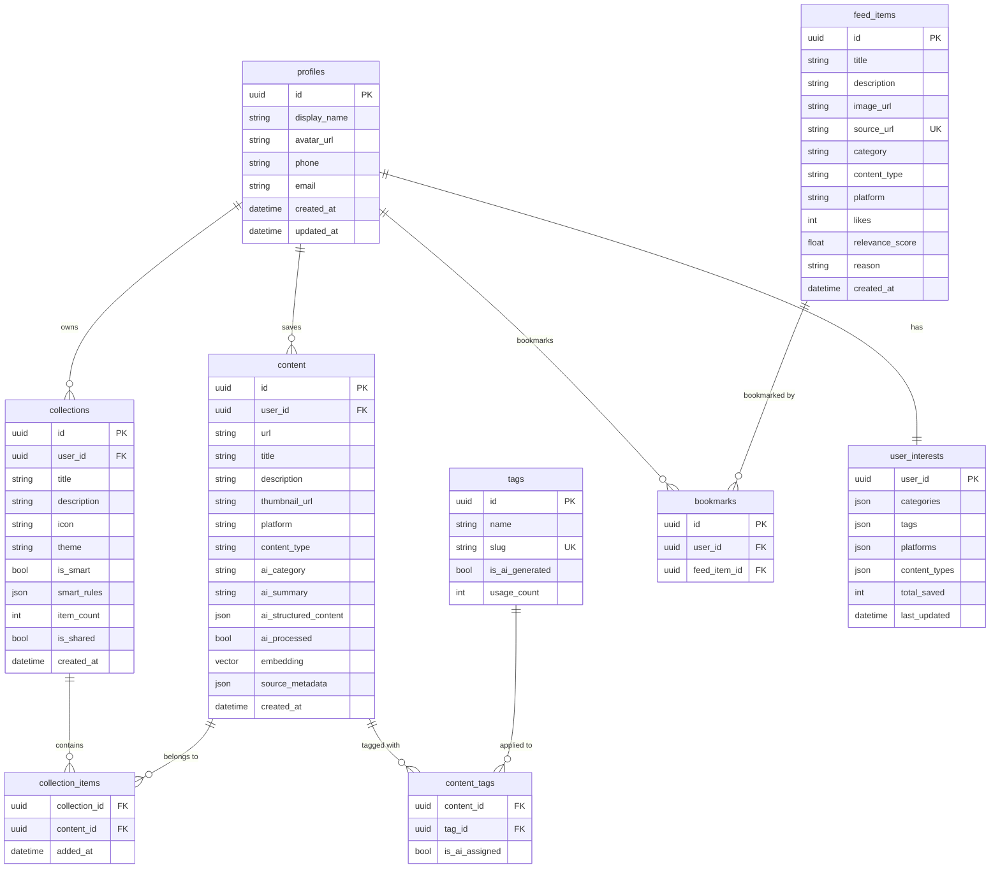
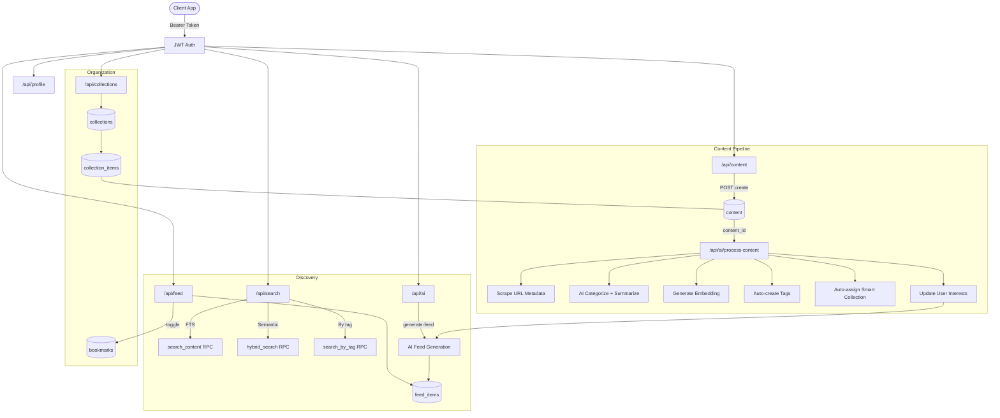
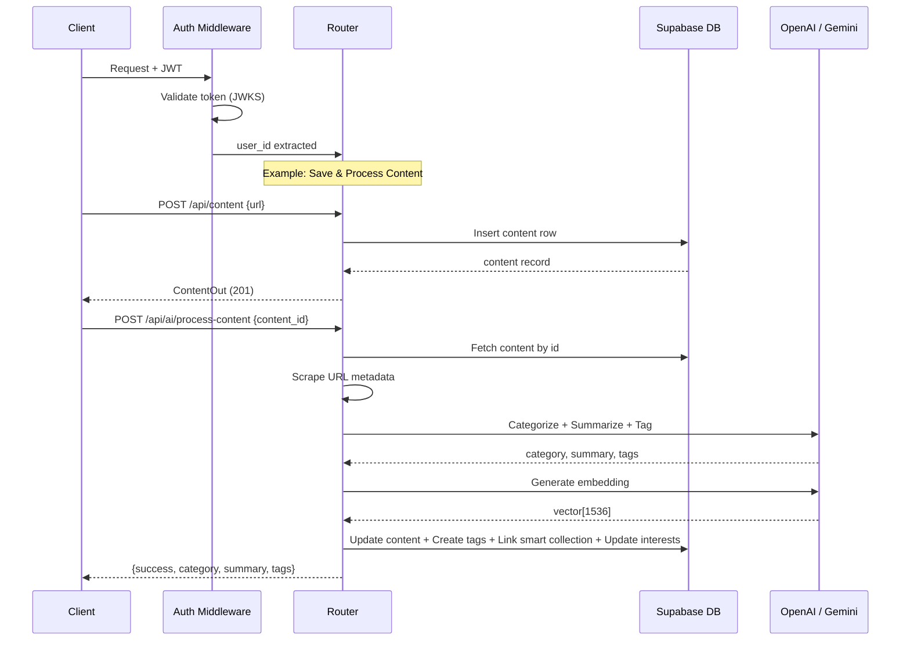

# Zuno API Documentation

**Base URL:** `http://localhost:8000`  
**Auth:** All endpoints (except `/health` and `/api/config`) require `Authorization: Bearer <JWT>` header.

---

## Health

| Method | Path | Auth | Description |
|--------|------|------|-------------|
| GET | `/health` | No | Health check |

**Response:** `{ "status": "ok", "service": "zuno-api" }`

---

## App Config `/api/config`

### GET `/api/config`
Returns dynamic app configuration. **Public — no auth required.** Called at app startup before sign-in.

**Response:**
```json
{
  "app_version": "1.0.0",
  "min_supported_version": "1.0.0",
  "maintenance_mode": false,
  "maintenance_message": null,
  "feature_flags": {
    "feed_enabled": true,
    "vfeed_enabled": false,
    "ai_processing_enabled": true,
    "search_enabled": true,
    "collections_enabled": true,
    "share_enabled": true
  },
  "content_limits": {
    "max_saves": 500,
    "max_collections": 50,
    "max_tags_per_content": 10
  },
  "feed_settings": {
    "page_size": 20,
    "refresh_interval_seconds": 300,
    "max_feed_items": 200
  },
  "app_links": {
    "terms_url": "https://zuno.app/terms",
    "privacy_url": "https://zuno.app/privacy",
    "support_url": "https://zuno.app/support",
    "app_store_url": "",
    "play_store_url": ""
  },
  "supported_platforms": ["youtube", "instagram", "x", "reddit", "tiktok", "spotify", "web"]
}
```

---

## Profile `/api/profile`

### GET `/api/profile`
Get current user's profile.

**Response:**
```json
{ "id": "str", "display_name": "str?", "avatar_url": "str?", "phone": "str?", "email": "str?", "created_at": "str", "updated_at": "str" }
```

### PATCH `/api/profile`
Update profile.

**Body:**
```json
{ "display_name": "str?", "avatar_url": "str?" }
```

---

## User Preferences `/api/user-preferences`

Per-user configuration. Auto-creates a default row on first GET.

### GET `/api/user-preferences`
Get the current user's preferences.

**Response:**
```json
{
  "id": "uuid",
  "user_id": "uuid",
  "feed_type": "usersaved",
  "created_at": "str",
  "updated_at": "str"
}
```

### PATCH `/api/user-preferences`
Update preferences. `feed_type` must be `"usersaved"` or `"suggestedcontent"`.

**Body:**
```json
{ "feed_type": "suggestedcontent" }
```

---

## Suggested Feed `/api/suggested-feed`

Returns content from other users' **shared collections**, ranked by relevance to the current user's interests (category overlap + tag overlap). Fresh on every request — nothing persisted.

### GET `/api/suggested-feed`
Get suggested content with infinite-scroll pagination.

**Query:** `limit` (1-100, default 20), `offset` (default 0), `category?`, `content_type?`

**Response:** Array of:
```json
{
  "id": "uuid",
  "user_id": "uuid",
  "url": "str",
  "title": "str?",
  "description": "str?",
  "thumbnail_url": "str?",
  "platform": "str",
  "content_type": "str",
  "ai_category": "str?",
  "ai_summary": "str?",
  "ai_structured_content": "obj?",
  "ai_processed": "bool",
  "source_metadata": "obj?",
  "relevance_score": 12.0,
  "created_at": "str",
  "updated_at": "str"
}
```

**Scoring:** `category_score` (0-20 based on rank in user's top 10 categories) + `tag_score` (count of overlapping tags). New users with no saved content get most-recent-first ordering.

---

## Content `/api/content`

### GET `/api/content`
List user's saved content.

**Query:** `limit` (1-100, default 20), `offset` (default 0), `category?`, `platform?`, `content_type?`

**Response:** Array of:
```json
{ "id": "str", "url": "str", "title": "str?", "description": "str?", "thumbnail_url": "str?", "platform": "str", "content_type": "str", "ai_category": "str?", "ai_summary": "str?", "ai_structured_content": "obj?", "ai_processed": "bool", "source_metadata": "obj?", "created_at": "str", "updated_at": "str" }
```

### GET `/api/content/{content_id}`
Get single content item. Same response shape as above.

### POST `/api/content`
Save new content.

**Body:**
```json
{ "url": "str", "title": "str?", "description": "str?", "thumbnail_url": "str?", "platform": "str (default: other)", "content_type": "str (default: post)" }
```

### PATCH `/api/content/{content_id}`
Update content. All fields optional.

**Body:**
```json
{ "url": "str?", "title": "str?", "description": "str?", "thumbnail_url": "str?", "platform": "str?", "content_type": "str?", "ai_category": "str?", "ai_summary": "str?" }
```

### DELETE `/api/content/{content_id}`
Delete content. Returns `204 No Content`.

### GET `/api/content/{content_id}/tags`
Get content with its tags. Returns content object with nested `content_tags` array.

---

## Collections `/api/collections`

### GET `/api/collections`
List all user collections.

**Response:** Array of:
```json
{ "id": "str", "title": "str", "description": "str?", "icon": "str", "theme": "str", "is_smart": "bool", "smart_rules": "obj?", "item_count": "int", "is_shared": "bool", "created_at": "str", "updated_at": "str" }
```

### GET `/api/collections/{collection_id}`
Get single collection. Same shape as above.

### POST `/api/collections`
Create collection.

**Body:**
```json
{ "title": "str", "description": "str?", "icon": "str (default: folder)", "theme": "str (default: blue)", "is_smart": "bool (default: false)", "smart_rules": "obj?" }
```

### PATCH `/api/collections/{collection_id}`
Update collection. All fields optional.

**Body:**
```json
{ "title": "str?", "description": "str?", "icon": "str?", "theme": "str?", "is_smart": "bool?", "smart_rules": "obj?", "is_shared": "bool?" }
```

### DELETE `/api/collections/{collection_id}`
Delete collection. Returns `204 No Content`.

### GET `/api/collections/{collection_id}/items`
Get items in a collection with joined content data.

### POST `/api/collections/{collection_id}/items`
Add content to collection.

**Body:** `{ "content_id": "str" }`  
**Response:** `{ "success": true }` (201)

### DELETE `/api/collections/{collection_id}/items/{content_id}`
Remove content from collection. Returns `204 No Content`.

### GET `/api/collections/categories`
Get distinct AI categories from user's processed content.

**Response:** `["category1", "category2", ...]`

---

## Feed `/api`

### GET `/api/feed`
Get feed items.

**Query:** `limit` (1-100, default 20), `offset` (default 0), `category?`, `content_type?`

**Response:** Array of:
```json
{ "id": "str", "title": "str", "description": "str?", "image_url": "str?", "source_url": "str", "category": "str?", "content_type": "str", "platform": "str", "likes": "int", "relevance_score": "float?", "reason": "str?", "created_at": "str" }
```

### GET `/api/bookmarks`
Get bookmarked feed item IDs.

**Response:** `["feed_item_id_1", "feed_item_id_2", ...]`

### POST `/api/bookmarks/{feed_item_id}/toggle`
Toggle bookmark on/off.

**Response:** `{ "bookmarked": true | false }`

---

## Search `/api/search`

### GET `/api/search`
Full-text search.

**Query:** `q` (required), `limit` (1-100, default 20)

**Response:** Array of:
```json
{ "id": "str", "url": "str", "title": "str?", "description": "str?", "thumbnail_url": "str?", "platform": "str", "content_type": "str", "ai_category": "str?", "ai_summary": "str?", "created_at": "str", "rank": "float?", "combined_score": "float?" }
```

### GET `/api/search/hybrid`
Hybrid search (full-text + semantic). Falls back to FTS if embedding fails. Same query & response as above.

### GET `/api/search/tag/{slug}`
Search by tag slug.

**Query:** `limit` (1-200, default 50)  
**Response:** Same shape as search results above.

### GET `/api/tags/popular`
Get popular tags.

**Query:** `limit` (1-100, default 20)

**Response:** `[{ "name": "str", "slug": "str", "count": "int" }]`

---

## AI `/api/ai`

### POST `/api/ai/process-content`
Run AI processing on saved content (scrape metadata, categorize, summarize, tag, embed).

**Body:** `{ "content_id": "str" }`

**Response:**
```json
{ "success": "bool", "category": "str?", "summary": "str?", "tags": ["str"] }
```

### POST `/api/ai/generate-embedding`
Generate embedding vector for text.

**Body:** `{ "text": "str" }`  
**Response:** `{ "embedding": [float, ...] }`

### POST `/api/ai/generate-feed`
Generate AI-powered feed recommendations based on user interests.

**Body:** None

**Response:**
```json
{ "items": [FeedItemOut], "interests": [["topic", count], ...] | null, "message": "str?" }
```

---

## Quick Reference

| # | Method | Endpoint | Summary |
|---|--------|----------|---------|
| 1 | GET | `/health` | Health check |
| 2 | GET | `/api/profile` | Get profile |
| 3 | PATCH | `/api/profile` | Update profile |
| 4 | GET | `/api/content` | List content |
| 5 | GET | `/api/content/:id` | Get content |
| 6 | POST | `/api/content` | Create content |
| 7 | PATCH | `/api/content/:id` | Update content |
| 8 | DELETE | `/api/content/:id` | Delete content |
| 9 | GET | `/api/content/:id/tags` | Get content tags |
| 10 | GET | `/api/collections` | List collections |
| 11 | GET | `/api/collections/:id` | Get collection |
| 12 | POST | `/api/collections` | Create collection |
| 13 | PATCH | `/api/collections/:id` | Update collection |
| 14 | DELETE | `/api/collections/:id` | Delete collection |
| 15 | GET | `/api/collections/:id/items` | Get collection items |
| 16 | POST | `/api/collections/:id/items` | Add to collection |
| 17 | DELETE | `/api/collections/:id/items/:cid` | Remove from collection |
| 18 | GET | `/api/collections/categories` | Get AI categories |
| 19 | GET | `/api/feed` | Get feed |
| 20 | GET | `/api/bookmarks` | Get bookmarks |
| 21 | POST | `/api/bookmarks/:id/toggle` | Toggle bookmark |
| 22 | GET | `/api/search` | Full-text search |
| 23 | GET | `/api/search/hybrid` | Hybrid search |
| 24 | GET | `/api/search/tag/:slug` | Search by tag |
| 25 | GET | `/api/tags/popular` | Popular tags |
| 26 | POST | `/api/ai/process-content` | AI process content |
| 27 | POST | `/api/ai/generate-embedding` | Generate embedding |
| 28 | POST | `/api/ai/generate-feed` | Generate AI feed |

**Total: 28 endpoints | Auth: JWT Bearer token | Framework: FastAPI | DB: Supabase**

---

## Data Model (ER Diagram)



## API Flow Diagram



## Request Lifecycle


