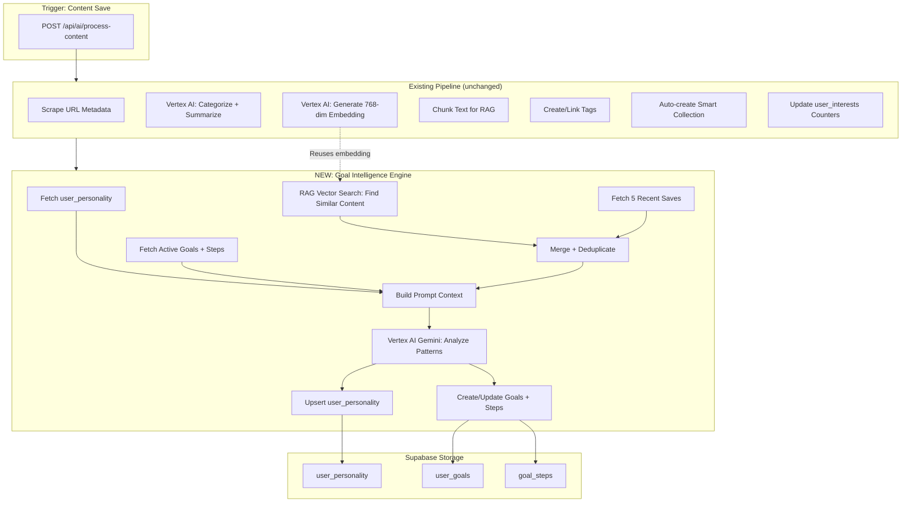
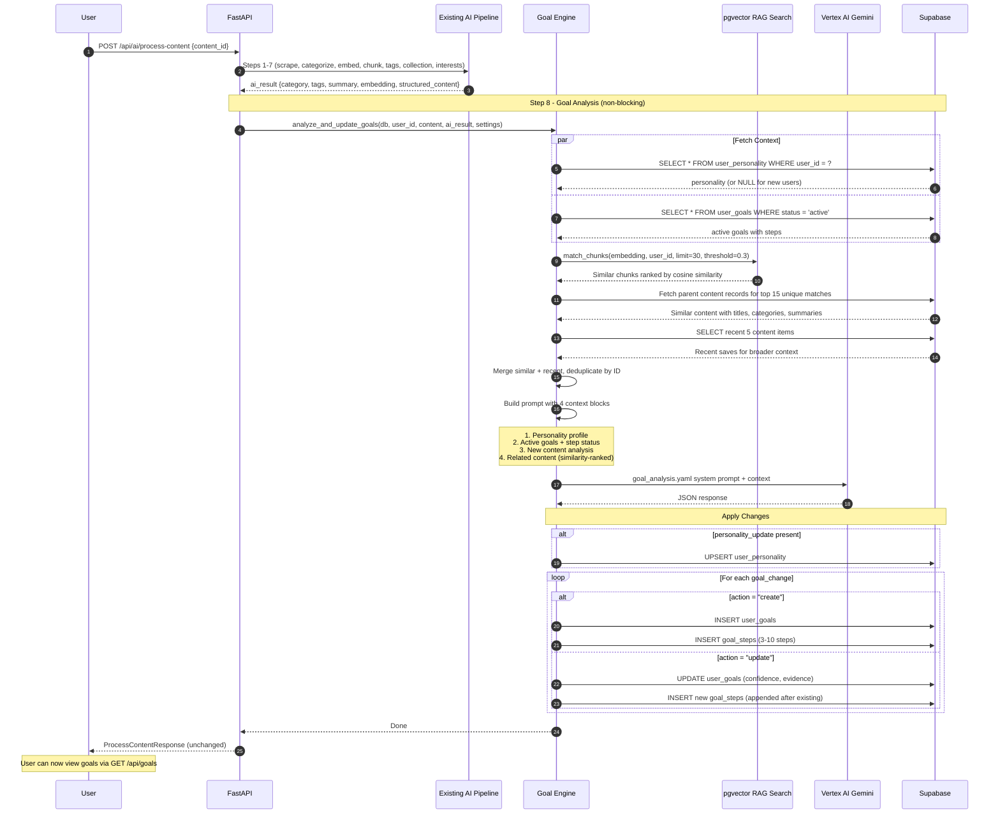

# Goals Intelligence Engine

> AI-powered intent detection and goal management system that analyzes user content patterns to automatically detect what the user is trying to achieve and generates actionable step-by-step goals.

---

## Table of Contents

1. [System Overview](#1-system-overview)
2. [End-to-End Data Flow](#2-end-to-end-data-flow)
3. [Database Schema](#3-database-schema)
4. [AI Processing Pipeline](#4-ai-processing-pipeline)
5. [RAG-Powered Pattern Detection](#5-rag-powered-pattern-detection)
6. [API Endpoints](#6-api-endpoints)
7. [File Map](#7-file-map)

---

## 1. System Overview



### Key Principle

The goal engine **piggybacks on the existing AI pipeline**. It does not duplicate work:

- The embedding was already generated for the content record -- the goal engine **reuses** it for RAG similarity search.
- The content analysis (category, tags, TLDR, save_motive) was already computed -- the goal engine reads those results.
- The only new Vertex AI call is a single Gemini prompt for pattern analysis and goal generation.

---

## 2. End-to-End Data Flow



### What Happens at Each Stage

| Stage | System | What Happens |
|-------|--------|-------------|
| Content save | FastAPI | Existing pipeline runs: scrape, categorize, embed, chunk, tag |
| Personality fetch | Supabase | Read the user's AI personality profile (empty on first save) |
| Goals fetch | Supabase | Read all active goals with their steps and completion status |
| RAG search | pgvector | Use the new content's embedding to find semantically similar past content across the user's entire library |
| Recent fetch | Supabase | Get 5 most recent saves for broader emerging-interest context |
| Prompt build | Python | Assemble 4 context blocks: personality, goals, new content, related content |
| AI analysis | Vertex AI | Single Gemini call: detect patterns, update personality, decide goal changes |
| Apply changes | Supabase | Upsert personality, create/update goals and steps |

---

## 3. Database Schema

### user_personality

Internal AI-managed table. One row per user.

| Column | Type | Description |
|--------|------|-------------|
| `user_id` | UUID PK | FK to auth.users |
| `summary` | TEXT | "A curious tech enthusiast exploring AI video tools..." |
| `primary_interests` | JSONB | `[{"name": "AI Video Editing", "confidence": 0.85}]` |
| `behavior_patterns` | JSONB | `["tool-explorer", "skill-builder"]` |
| `content_themes` | JSONB | `["AI creativity tools", "automation"]` |
| `last_analyzed_content_id` | UUID | Last content that triggered analysis |
| `version` | INT | Increments on each update |
| `created_at` / `updated_at` | TIMESTAMPTZ | Timestamps |

### user_goals

User-facing interactive goals.

| Column | Type | Description |
|--------|------|-------------|
| `id` | UUID PK | Goal ID |
| `user_id` | UUID FK | FK to auth.users |
| `title` | TEXT | "Master AI Video Editing" |
| `description` | TEXT | Why AI detected this goal |
| `category` | TEXT | Broad category |
| `status` | TEXT | `active` / `completed` / `dismissed` |
| `confidence` | FLOAT | 0.0 - 1.0 |
| `evidence_content_ids` | UUID[] | Content IDs that support this goal |
| `ai_reasoning` | TEXT | Internal: why AI created this |
| `created_at` / `updated_at` | TIMESTAMPTZ | Timestamps |

### goal_steps

Interactive steps within each goal.

| Column | Type | Description |
|--------|------|-------------|
| `id` | UUID PK | Step ID |
| `goal_id` | UUID FK | FK to user_goals (CASCADE delete) |
| `step_index` | INT | Order (0-based) |
| `title` | TEXT | Step title |
| `description` | TEXT | Detailed instruction |
| `source_content_ids` | UUID[] | Content that inspired this step |
| `is_completed` | BOOL | User toggle |
| `completed_at` | TIMESTAMPTZ | When marked complete |
| `created_at` / `updated_at` | TIMESTAMPTZ | Timestamps |

---

## 4. AI Processing Pipeline

### Prompt Structure

The `goal_analysis.yaml` prompt receives 4 context blocks:

1. **Personality Context** -- current profile summary, interests, patterns, themes (or "new user" marker)
2. **Goals Context** -- all active goals with steps and `[DONE]` / `[ ]` markers
3. **New Content Context** -- the just-saved item: title, URL, platform, category, tags, TLDR, key_points, save_motive
4. **Related Content Context** -- up to 20 items found via RAG similarity + recent saves, each with similarity score or "recent save" marker

### AI Response Format

```json
{
  "personality_update": {
    "summary": "A creative professional exploring AI-powered video editing...",
    "primary_interests": [
      {"name": "AI Video Editing", "confidence": 0.85},
      {"name": "Content Creation", "confidence": 0.6}
    ],
    "behavior_patterns": ["tool-explorer", "skill-builder"],
    "content_themes": ["AI creativity tools", "video production"]
  },
  "goal_changes": [
    {
      "action": "create",
      "title": "Master AI Video Editing",
      "description": "Based on 3 saved items about AI video tools...",
      "category": "Tech",
      "confidence": 0.85,
      "reasoning": "3 items about AI video editing saved recently",
      "steps": [
        {
          "title": "Explore Runway ML basics",
          "description": "Watch the saved tutorial on text-to-video generation",
          "source_content_indices": [0]
        }
      ]
    },
    {
      "action": "update",
      "goal_id": "existing-uuid",
      "add_evidence_content_indices": [0],
      "updated_confidence": 0.92,
      "new_steps": [
        {
          "title": "Try the CapCut AI features",
          "description": "Apply techniques from the newly saved article",
          "source_content_indices": [0]
        }
      ]
    }
  ]
}
```

### Goal Creation Rules (enforced by prompt)

- Minimum 2 related content items required (or 1 very specific item)
- Minimum 0.6 confidence threshold
- Title must be action-oriented
- 3-10 steps per goal
- Steps must reference actual saved content

### Goal Update Rules (enforced by prompt)

- Completed steps are never modified
- New steps are appended after existing ones
- Confidence can increase as more evidence arrives
- Description can be refined as intent becomes clearer

---

## 5. RAG-Powered Pattern Detection

Instead of naively fetching the last N items, the goal engine uses the **same pgvector infrastructure** as the knowledge engine:

1. The new content's embedding (768-dim, already generated) is used as the query vector
2. The `match_chunks` RPC searches `content_chunks` for cosine similarity >= 0.3
3. Results are deduplicated by `content_id` (keeping highest similarity per content)
4. Parent content records are fetched with full metadata
5. A small recent window (5 items) provides broader context

**Why this is better than chronological fetch:**

| Approach | Scope | Precision | Scalability |
|----------|-------|-----------|-------------|
| Last 20 items | Only recent | Low -- unrelated items dilute signal | Misses old patterns |
| RAG similarity | Entire library | High -- only semantically related items | Works at any scale |

---

## 6. API Endpoints

| Method | Path | Description |
|--------|------|-------------|
| `GET` | `/api/goals` | List goals (optional `?status=active\|completed\|dismissed`) |
| `GET` | `/api/goals/{id}` | Goal detail with all steps |
| `PATCH` | `/api/goals/{id}` | Update title, description, or status |
| `PATCH` | `/api/goals/{id}/steps/{step_id}` | Toggle step completion |
| `DELETE` | `/api/goals/{id}` | Delete goal (cascades to steps) |

### Example: List Active Goals

```
GET /api/goals?status=active
Authorization: Bearer <jwt>
```

```json
[
  {
    "id": "abc-123",
    "user_id": "user-456",
    "title": "Master AI Video Editing",
    "description": "Based on 3 saved items about AI video tools...",
    "category": "Tech",
    "status": "active",
    "confidence": 0.85,
    "evidence_content_ids": ["content-1", "content-2", "content-3"],
    "created_at": "2026-02-11T10:00:00Z",
    "updated_at": "2026-02-11T12:00:00Z"
  }
]
```

### Example: Toggle Step Completion

```
PATCH /api/goals/abc-123/steps/step-789
Authorization: Bearer <jwt>
Content-Type: application/json

{"is_completed": true}
```

---

## 7. File Map

| File | Purpose |
|------|---------|
| `supabase/migrations/20260211100000_user_goals.sql` | Database tables, RLS, indexes, triggers |
| `app/services/goal_engine.py` | Core engine: context fetch, RAG search, AI call, DB mutations |
| `app/prompts/goal_analysis.yaml` | System prompt + user template for Gemini |
| `app/schemas/models.py` | Pydantic models: GoalOut, GoalDetailOut, GoalStepOut, etc. |
| `app/routers/goals.py` | REST endpoints for goal CRUD |
| `app/routers/ai.py` | Modified: calls `analyze_and_update_goals()` in step 8 |
| `app/main.py` | Modified: registers `goals.router` |
| `static/index.html` | Test UI: Goals tab, goal list, goal detail, step toggling |
