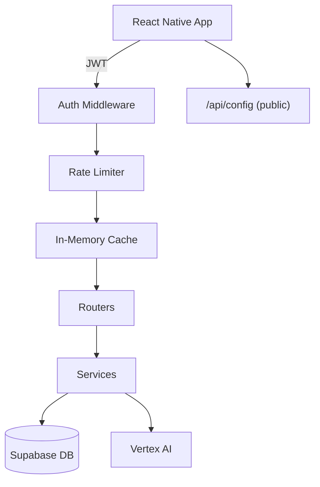
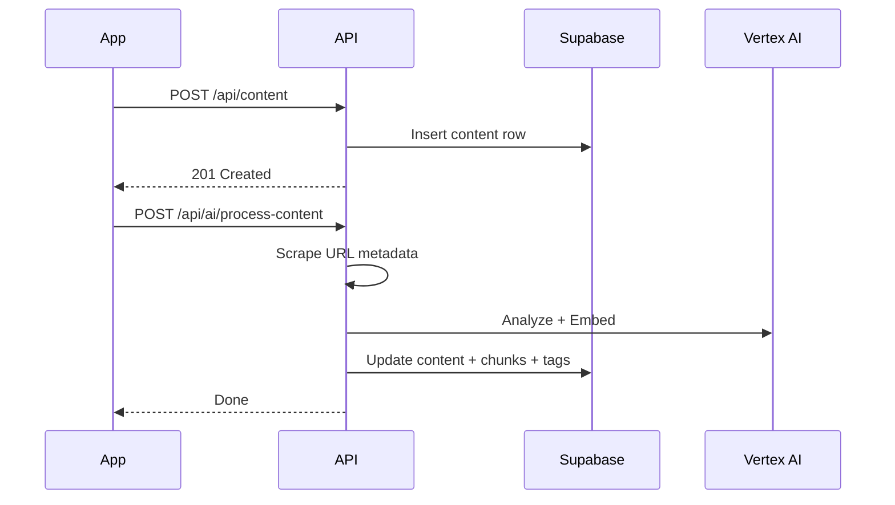
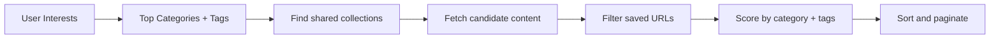
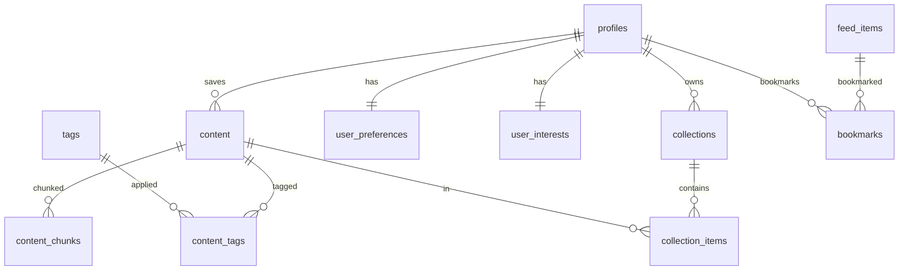

# Zuno Backend API Documentation

**Base URL:** `http://localhost:8000` | **Framework:** FastAPI  | **DB:** Supabase + pgvector | **AI:** Vertex AI (Gemini + text-embedding-005)

---

## Auth

All endpoints require `Authorization: Bearer <JWT>` except `GET /health` and `GET /api/config`.

JWT is a Supabase-issued token verified via JWKS or HMAC.

---

## Architecture

## Data Flow: Save + Process Content

## Suggested Feed Flow

---

## Endpoints

### Health + Config

| Method | Path | Auth | Description |
|--------|------|------|-------------|
| GET | `/health` | No | Health check |
| GET | `/api/config` | No | Global app config (flags, limits, links) |

### Profile

| Method | Path | Auth | Description |
|--------|------|------|-------------|
| GET | `/api/profile` | Yes | Get user profile |
| PATCH | `/api/profile` | Yes | Update display_name / avatar_url |

### User Preferences

| Method | Path | Auth | Description |
|--------|------|------|-------------|
| GET | `/api/user-preferences` | Yes | Get preferences (auto-creates default) |
| PATCH  | `/api/user-preferences` | Yes | Update `feed_type`: `usersaved` or `suggestedcontent` |

### Collections

| Method | Path | Auth | Description |
|--------|------|------|-------------|
| GET | `/api/collections` | Yes | List (optional `?category=`) |
| GET | `/api/collections/categories` | Yes | Distinct AI categories (cached 15m) |
| GET | `/api/collections/{id}` | Yes | Single collection |
| POST | `/api/collections` | Yes | Create |
| PATCH  | `/api/collections/{id}` | Yes | Update |
| DELETE | `/api/collections/{id}` | Yes | Delete |
| GET | `/api/collections/{id}/items` | Yes | Items in collection |
| POST | `/api/collections/{id}/items` | Yes | Add content |
| DELETE | `/api/collections/{id}/items/{cid}` | Yes | Remove content |

### Content

| Method | Path | Auth | Description |
|--------|------|------|-------------|
| GET | `/api/content` | Yes | List (limit, offset, category, platform, content_type) |
| GET | `/api/content/{id}` | Yes | Single content |
| POST | `/api/content` | Yes | Save new |
| PATCH  | `/api/content/{id}` | Yes | Update |
| DELETE | `/api/content/{id}` | Yes | Delete |
| GET | `/api/content/{id}/tags` | Yes | Content with tags |

### Feed

| Method | Path | Auth | Description |
|--------|------|------|-------------|
| GET | `/api/feed` | Yes | Feed items (cached 5m) |
| GET | `/api/bookmarks` | Yes | Bookmarked feed_item_ids |
| POST | `/api/bookmarks/{id}/toggle` | Yes | Toggle bookmark |

### Suggested Feed

| Method | Path | Auth | Description |
|--------|------|------|-------------|
| GET | `/api/suggested-feed` | Yes | Interest-ranked from shared collections (cached 10m) |

Scoring: `category_rank (0-20) + tag_overlap_count`. Deduplicates by URL. New users get recency-first.

### Search

| Method | Path | Auth | Description |
|--------|------|------|-------------|
| GET | `/api/search?q=&limit=` | Yes | Full-text search |
| GET | `/api/search/hybrid?q=&limit=` | Yes | Hybrid FTS + semantic |
| GET | `/api/search/tag/{slug}` | Yes | Tag-based search |
| GET | `/api/tags/popular` | Yes | Popular tags (cached 10m) |

### AI

| Method | Path | Auth | Rate | Description |
|--------|------|------|------|-------------|
| POST | `/api/ai/process-content` | Yes | 30/hr | Scrape, categorize, summarize, embed, chunk |
| POST | `/api/ai/generate-embedding` | Yes | 60/hr | Generate embedding |
| POST | `/api/ai/generate-feed` | Yes | 10/hr | AI feed recommendations |

### Knowledge / RAG

| Method | Path | Auth | Rate | Description |
|--------|------|------|------|-------------|
| POST | `/api/knowledge/ask` | Yes | 30/min | RAG: embed query, retrieve chunks, generate answer |
| POST | `/api/knowledge/reindex` | Yes | 5/hr | Re-chunk and re-embed content |
| GET | `/api/knowledge/stats` | Yes | 30/min | Knowledge base stats |

### Admin

| Method | Path | Auth | Description |
|--------|------|------|-------------|
| GET | `/api/admin/cache/stats` | Yes | Cache statistics |
| POST | `/api/admin/cache/bust?pattern=` | Yes | Invalidate cache |
| POST | `/api/admin/prompts/reload` | Yes | Reload YAML prompts |

---

## Database Schema

### Key Tables

| Table | Key Columns |
|-------|-------------|
| `profiles` | id, display_name, avatar_url, email |
| `content` | id, user_id, url, title, ai_category, ai_summary, embedding (768-dim), full_text |
| `collections` | id, user_id, title, is_smart, is_shared, item_count |
| `content_chunks` | id, content_id, chunk_index, chunk_text, embedding (768-dim) |
| `user_preferences` | id, user_id, feed_type |
| `user_interests` | id, user_id, categories (jsonb), tags (jsonb), total_saved |
| `tags` | id, name, slug, usage_count |

### RPC Functions

| Function | Purpose |
|----------|---------|
| `search_content` | Full-text search |
| `hybrid_search` | FTS + semantic via Reciprocal Rank Fusion |
| `search_by_tag` | Tag-based search |
| `match_chunks` | Vector similarity for RAG |

---

## Services

| Service | Purpose |
|---------|---------|
| `ai_service.py` | All AI: analyze, embed, RAG answer, feed gen |
| `chunking_service.py` | Sentence-aware text chunking (~500 tokens) |
| `metadata_service.py` | URL scraping (OG tags, body text) |
| `collection_manager.py` | Auto-create smart collections per category |
| `suggested_feed_service.py` | Interest-based feed from shared collections |
| `feed_generator.py` | Rule-based fallback feed |

## Utils

| Util | Purpose |
|------|---------|
| `cache.py` | `@cache(ttl)` decorator, max 2048 entries |
| `rate_limit.py` | SlowAPI limiter (per-user or IP) |

## Config (.env)

| Variable | Default | Required |
|----------|---------|----------|
| `SUPBASE_URL` | - | Yes |
| `SUPABASE_SERVICE_ROLE_KEY` | - | Yes |
| `SUPABASE_JWT_SECRET` | - | Yes |
| `GCP_PROJECT_ID` | - | For AI/RAG |
| `GCP_LOCATION` | us-central1 | No |
| `GCP_CREDENTIALS_JSON` | - | For AI/RAG |
| `BACKEND_PORT` | 8000 | No |
| `CORS_ORIGINS` | http://localhost:8081 | No |
