# Zuno — Content Lifecycle & Data Flow

> End-to-end documentation of how content enters the system, gets processed, stored, and consumed.

---

## Table of Contents

1. [High-Level Architecture](#1-high-level-architecture)
2. [Content Ingestion Flow](#2-content-ingestion-flow)
3. [AI Processing Pipeline (Vertex AI)](#3-ai-processing-pipeline-vertex-ai)
4. [RAG Chunking & Embedding Pipeline](#4-rag-chunking--embedding-pipeline)
5. [Storage Layer (Supabase)](#5-storage-layer-supabase)
6. [Content Consumption Flows](#6-content-consumption-flows)
7. [Search & Knowledge Engine](#7-search--knowledge-engine)
8. [Feed Generation Flow](#8-feed-generation-flow)
9. [Supabase vs Vertex AI — Responsibility Split](#9-supabase-vs-vertex-ai--responsibility-split)
10. [Complete Entity Relationship Diagram](#10-complete-entity-relationship-diagram)
11. [Caching & Rate Limiting](#11-caching--rate-limiting)
12. [Batch Reprocessing](#12-batch-reprocessing)

---

## 1. High-Level Architecture

```mermaid
graph TB
    subgraph Client["📱 Client App"]
        Mobile["Mobile / Web App"]
    end

    subgraph Backend["⚙️ FastAPI Backend"]
        API["REST API Layer<br/>(11 Routers)"]
        Auth["JWT Auth<br/>(dependencies.py)"]
        Services["Service Layer"]
        Cache["In-Memory TTL Cache<br/>(2048 entries)"]
        RateLimiter["Rate Limiter<br/>(slowapi)"]
    end

    subgraph VertexAI["🤖 Google Vertex AI"]
        Gemini["Gemini 2.0 Flash<br/>(Text Generation)"]
        EmbModel["text-embedding-005<br/>(768-dim Vectors)"]
    end

    subgraph Supabase["🗄️ Supabase"]
        SupaAuth["Auth (JWT Issuer)"]
        PostgreSQL["PostgreSQL + pgvector"]
        RPC["RPC Functions<br/>(search, match, etc.)"]
    end

    subgraph External["🌐 External"]
        URLs["Source URLs<br/>(YouTube, Articles, etc.)"]
    end

    Mobile -->|"HTTP + JWT"| API
    API --> Auth -->|"Validate Token"| SupaAuth
    API --> RateLimiter
    API --> Services
    Services -->|"Scrape metadata"| URLs
    Services -->|"AI Analysis<br/>Embeddings<br/>RAG Answers"| VertexAI
    Services -->|"CRUD + Vector Search"| PostgreSQL
    Services --> Cache
    PostgreSQL --> RPC
```

---

## 2. Content Ingestion Flow

This is the journey of a piece of content from the moment a user saves it.

```mermaid
sequenceDiagram
    autonumber
    participant User as 📱 User
    participant API as ⚙️ FastAPI
    participant Auth as 🔑 JWT Auth
    participant Meta as 🔍 Metadata Service
    participant URL as 🌐 Source URL
    participant AI as 🤖 AI Service
    participant Vertex as ☁️ Vertex AI
    participant DB as 🗄️ Supabase DB

    User->>API: POST /api/content<br/>{url, title, description, platform, content_type}
    API->>Auth: Validate JWT Token
    Auth-->>API: user_id extracted

    API->>DB: INSERT into content table<br/>(raw content, user_id)
    DB-->>API: content record {id, ...}
    API-->>User: 201 Created — ContentOut

    Note over User,DB: Phase 1 Complete — Content saved (unprocessed)

    User->>API: POST /api/ai/process-content<br/>{content_id}
    API->>Auth: Validate JWT
    API->>DB: Fetch content record by id

    rect rgb(255, 245, 230)
        Note over API,URL: Step 1 — URL Metadata Scraping
        API->>Meta: scrape_url(content.url)
        Meta->>URL: HTTP GET (httpx)
        URL-->>Meta: HTML Response
        Meta->>Meta: BeautifulSoup parsing<br/>Extract OG tags + body text<br/>(up to 8000 chars)
        Meta-->>API: {title, description, thumbnail, full_text}
    end

    rect rgb(230, 245, 255)
        Note over API,Vertex: Step 2 — AI Content Analysis
        API->>AI: process_with_ai(text, url, platform)
        AI->>AI: Load content_analysis.yaml prompt
        AI->>Vertex: Gemini 2.0 Flash<br/>Structured prompt + content text
        Vertex-->>AI: JSON Response
        AI->>AI: Parse: category, tags, tldr,<br/>key_points, action_items, save_motive
        AI-->>API: AIAnalysis result
    end

    rect rgb(230, 255, 230)
        Note over API,Vertex: Step 3 — Embedding Generation
        API->>AI: generate_embedding(text)
        AI->>Vertex: text-embedding-005<br/>task_type: RETRIEVAL_DOCUMENT
        Vertex-->>AI: 768-dim float vector
        AI-->>API: embedding[]
    end

    rect rgb(245, 230, 255)
        Note over API,DB: Step 4 — RAG Chunking
        API->>AI: chunk_and_embed(full_text)
        AI->>AI: Split into ~500 token chunks<br/>(50 token overlap)
        AI->>Vertex: Batch embed all chunks<br/>(up to 250/batch)
        Vertex-->>AI: chunk embeddings[]
        AI->>DB: INSERT into content_chunks<br/>(chunk_text, embedding, metadata)
    end

    rect rgb(255, 230, 230)
        Note over API,DB: Step 5 — Tag & Collection Management
        API->>DB: UPSERT tags (name, slug)<br/>INCREMENT usage_count
        API->>DB: INSERT content_tags links
        API->>DB: UPSERT smart collection<br/>for ai_category
        API->>DB: INSERT collection_items link
        API->>DB: UPDATE user_interests counters
    end

    API->>DB: UPDATE content SET<br/>ai_processed=true,<br/>ai_category, ai_summary,<br/>ai_structured_content, embedding,<br/>full_text, source_metadata
    API-->>User: 200 OK — Processed content
```

---

## 3. AI Processing Pipeline (Vertex AI)

A detailed breakdown of what Vertex AI does and what the prompts produce.

```mermaid
flowchart LR
    subgraph Input["📥 Input"]
        RawText["Scraped Body Text<br/>(up to 8000 chars)"]
        URL["Content URL"]
        Platform["Platform<br/>(youtube, article, etc.)"]
    end

    subgraph VertexGeneration["🤖 Vertex AI — Gemini 2.0 Flash"]
        Prompt["content_analysis.yaml<br/>Structured Prompt"]
        LLM["gemini-2.0-flash-001"]
    end

    subgraph Output["📤 AI Output (JSON)"]
        Category["category<br/>(e.g. 'Cooking', 'Tech')"]
        Tags["tags[]<br/>(3-5 tags)"]
        Title["title<br/>(cleaned/enhanced)"]
        TLDR["tldr<br/>(1-2 sentence summary)"]
        KeyPoints["key_points[]<br/>(4-8 points)"]
        Actions["action_items[]<br/>(actionable steps)"]
        Motive["save_motive<br/>(why user saved this)"]
    end

    subgraph Embedding["🧮 Vertex AI — Embedding Model"]
        EmbModel["text-embedding-005"]
        Vector["768-dim Vector"]
    end

    RawText --> Prompt
    URL --> Prompt
    Platform --> Prompt
    Prompt --> LLM
    LLM --> Category
    LLM --> Tags
    LLM --> Title
    LLM --> TLDR
    LLM --> KeyPoints
    LLM --> Actions
    LLM --> Motive

    RawText --> EmbModel
    EmbModel --> Vector
```

### AI Output Storage Mapping

```mermaid
flowchart TD
    AIOutput["AI Output JSON"]

    AIOutput --> Col1["content.ai_category"]
    AIOutput --> Col2["content.ai_summary"]
    AIOutput --> Col3["content.ai_structured_content (JSONB)"]
    AIOutput --> Col4["content.embedding (vector 768)"]
    AIOutput --> Col5["tags table → content_tags join"]
    AIOutput --> Col6["collections table<br/>(smart collection auto-created)"]

    Col3 --> SC1["tldr"]
    Col3 --> SC2["key_points[]"]
    Col3 --> SC3["action_items[]"]
    Col3 --> SC4["save_motive"]
```

---

## 4. RAG Chunking & Embedding Pipeline

```mermaid
flowchart TB
    FullText["full_text<br/>(scraped body, up to 8000 chars)"]

    FullText --> Chunker["chunking_service.py<br/>Split into ~500 token chunks<br/>50 token overlap"]

    Chunker --> C1["Chunk 1<br/>~500 tokens"]
    Chunker --> C2["Chunk 2<br/>~500 tokens"]
    Chunker --> C3["Chunk N<br/>~500 tokens"]

    C1 --> BatchEmbed["Vertex AI — Batch Embedding<br/>text-embedding-005<br/>(up to 250 chunks/batch)"]
    C2 --> BatchEmbed
    C3 --> BatchEmbed

    BatchEmbed --> E1["Embedding 1<br/>(768-dim)"]
    BatchEmbed --> E2["Embedding 2<br/>(768-dim)"]
    BatchEmbed --> E3["Embedding N<br/>(768-dim)"]

    E1 --> DB1["content_chunks row 1<br/>{chunk_text, embedding,<br/>chunk_index, token_count,<br/>metadata: {title, url, platform, category}}"]
    E2 --> DB2["content_chunks row 2"]
    E3 --> DB3["content_chunks row N"]

    DB1 --> Supabase["🗄️ Supabase PostgreSQL<br/>+ pgvector"]
    DB2 --> Supabase
    DB3 --> Supabase
```

---

## 5. Storage Layer (Supabase)

### What Supabase Handles

```mermaid
flowchart TB
    subgraph SupabaseResponsibilities["🗄️ Supabase — Full Responsibility"]

        subgraph Auth["🔐 Authentication"]
            JWT["JWT Token Issuance"]
            JWKS["JWKS Public Keys<br/>(for verification)"]
            UserMgmt["User Management<br/>(auth.users)"]
        end

        subgraph Database["💾 PostgreSQL Database"]
            Content["content table<br/>(main content records)"]
            Chunks["content_chunks table<br/>(RAG vectors)"]
            TagsT["tags + content_tags<br/>(tagging system)"]
            Collections["collections +<br/>collection_items"]
            Feed["feed_items +<br/>bookmarks"]
            Profiles["profiles table"]
            UserInt["user_interests<br/>(activity counters)"]
            UserPref["user_preferences<br/>(feed settings)"]
        end

        subgraph VectorSearch["🔎 pgvector Extension"]
            VecStore["768-dim vector storage"]
            CosineSim["Cosine similarity search"]
            MatchChunks["match_chunks() RPC"]
            HybridSearch["hybrid_search() RPC"]
        end

        subgraph FTS["📝 Full-Text Search"]
            SearchContent["search_content() RPC"]
            SearchByTag["search_by_tag() RPC"]
        end

        subgraph RLS["🛡️ Row Level Security"]
            Policies["Per-user data isolation"]
        end
    end

    Content --> VecStore
    Chunks --> VecStore
    VecStore --> CosineSim
```

### Data Volume Per Content Item

---

## 6. Content Consumption Flows

### Reading Content

```mermaid
sequenceDiagram
    participant User as 📱 User
    participant API as ⚙️ FastAPI
    participant Cache as 💾 Cache
    participant DB as 🗄️ Supabase

    User->>API: GET /api/content?category=Tech&limit=20
    API->>DB: SELECT from content<br/>WHERE user_id = ? AND ai_category = ?<br/>ORDER BY created_at DESC<br/>LIMIT 20 OFFSET 0
    DB-->>API: content rows[]
    API-->>User: ContentOut[] with ai_structured_content

    User->>API: GET /api/content/{id}
    API->>DB: SELECT from content WHERE id = ?
    DB-->>API: single content row
    API-->>User: Full ContentOut<br/>(tldr, key_points, action_items, tags)
```

### Browsing Collections

```mermaid
sequenceDiagram
    participant User as 📱 User
    participant API as ⚙️ FastAPI
    participant Cache as 💾 Cache
    participant DB as 🗄️ Supabase

    User->>API: GET /api/collections
    API->>DB: SELECT from collections<br/>WHERE user_id = ?
    DB-->>API: collections[]
    API-->>User: CollectionOut[]

    User->>API: GET /api/collections/{id}/items
    API->>DB: SELECT content via collection_items join<br/>WHERE collection_id = ?
    DB-->>API: content rows[]
    API-->>User: ContentOut[]
```

---

## 7. Search & Knowledge Engine

### Search Flow (3 Modes)

### RAG Knowledge Engine (Ask a Question)

```mermaid
sequenceDiagram
    autonumber
    participant User as 📱 User
    participant API as ⚙️ FastAPI
    participant Vertex as ☁️ Vertex AI
    participant DB as 🗄️ Supabase

    User->>API: POST /api/knowledge/ask<br/>{question: "How do I make pasta?"}

    rect rgb(230, 245, 255)
        Note over API,Vertex: Step 1 — Embed the question
        API->>Vertex: text-embedding-005<br/>task_type: RETRIEVAL_QUERY
        Vertex-->>API: query_embedding (768-dim)
    end

    rect rgb(230, 255, 230)
        Note over API,DB: Step 2 — Vector similarity search
        API->>DB: match_chunks() RPC<br/>(query_embedding, user_id,<br/>match_count=8, threshold=0.3)
        DB-->>API: Top 8 matching chunks<br/>(chunk_text + similarity score)
    end

    rect rgb(255, 245, 230)
        Note over API,Vertex: Step 3 — Generate answer from context
        API->>API: Build context from chunks<br/>Load rag_answer.yaml prompt
        API->>Vertex: Gemini 2.0 Flash<br/>"Given this context from the user's<br/>saved content, answer the question..."
        Vertex-->>API: Generated answer + sources
    end

    API-->>User: {answer, sources[], chunks_used}
```

---

## 8. Feed Generation Flow

---

## 9. Supabase vs Vertex AI — Responsibility Split

### Detailed Breakdown

```mermaid
flowchart LR
    subgraph Supabase["🗄️ Supabase — 60% of Work"]
        S1["✅ User authentication (JWT)"]
        S2["✅ ALL data persistence"]
        S3["✅ Vector storage (pgvector)"]
        S4["✅ Full-text search (PostgreSQL FTS)"]
        S5["✅ Vector similarity search"]
        S6["✅ Hybrid search (FTS + vector)"]
        S7["✅ Row-level security"]
        S8["✅ Tag management"]
        S9["✅ Collection management"]
        S10["✅ User profiles & preferences"]
        S11["✅ Feed item storage"]
        S12["✅ Bookmark management"]
    end

    subgraph Vertex["🤖 Vertex AI — 30% of Work"]
        V1["✅ Content categorization"]
        V2["✅ Content summarization (TLDR)"]
        V3["✅ Key point extraction"]
        V4["✅ Action item extraction"]
        V5["✅ Save motive inference"]
        V6["✅ Tag generation"]
        V7["✅ Document embeddings (768-dim)"]
        V8["✅ Query embeddings"]
        V9["✅ RAG answer generation"]
        V10["✅ Feed recommendation generation"]
    end

    subgraph Backend["⚙️ Backend — 10% of Work"]
        B1["✅ URL scraping (httpx + BS4)"]
        B2["✅ Text chunking (~500 tokens)"]
        B3["✅ Request orchestration"]
        B4["✅ Caching (in-memory TTL)"]
        B5["✅ Rate limiting"]
        B6["✅ Prompt management (YAML)"]
        B7["✅ Smart collection logic"]
        B8["✅ Interest tracking"]
    end
```

### When Each System is Called

| Action | Supabase | Vertex AI | Backend Only |
|--------|----------|-----------|--------------|
| Save content (raw) | **Write** | — | — |
| Process content | **Read + Write** | **Analyze + Embed** | **Scrape + Orchestrate** |
| RAG chunk & store | **Write chunks** | **Batch embed** | **Chunk text** |
| Search (full-text) | **FTS query** | — | — |
| Search (hybrid) | **FTS + vector query** | **Embed query** | — |
| Search (by tag) | **Tag join query** | — | — |
| Ask knowledge Q | **Vector search** | **Embed query + Generate answer** | — |
| Browse content | **Read** | — | **Cache** |
| Browse collections | **Read** | — | **Cache** |
| Generate feed (AI) | **Read interests + Write feed** | **Generate recs** | — |
| Suggested feed | **Read shared + interests** | — | **Score + Cache** |
| Toggle bookmark | **Write** | — | — |
| User profile | **Read/Write** | — | — |
| Auth | **JWT validation** | — | — |

---

## 10. Complete Entity Relationship Diagram

```mermaid
erDiagram
    AUTH_USERS {
        uuid id PK
        string email
        timestamp created_at
    }

    PROFILES {
        uuid id PK "FK → auth.users"
        string display_name
        string avatar_url
        string phone
        string email
    }

    CONTENT {
        uuid id PK
        uuid user_id FK
        string url
        string title
        string description
        string thumbnail_url
        string platform
        string content_type
        string ai_category
        string ai_summary
        jsonb ai_structured_content "tldr, key_points, action_items, save_motive"
        boolean ai_processed
        vector embedding "768-dim"
        text full_text
        jsonb source_metadata
        timestamp created_at
        timestamp updated_at
    }

    CONTENT_CHUNKS {
        uuid id PK
        uuid content_id FK
        uuid user_id FK
        int chunk_index
        text chunk_text
        int token_count
        vector embedding "768-dim"
        jsonb metadata "title, url, platform, category"
    }

    TAGS {
        uuid id PK
        string name
        string slug
        int usage_count
        boolean is_ai_generated
    }

    CONTENT_TAGS {
        uuid content_id FK
        uuid tag_id FK
        boolean is_ai_assigned
    }

    COLLECTIONS {
        uuid id PK
        uuid user_id FK
        string title
        string description
        string icon
        string theme
        boolean is_smart
        jsonb smart_rules
        int item_count
        boolean is_shared
        timestamp created_at
    }

    COLLECTION_ITEMS {
        uuid collection_id FK
        uuid content_id FK
        timestamp added_at
    }

    USER_INTERESTS {
        uuid user_id PK "FK → auth.users"
        jsonb categories
        jsonb tags
        jsonb platforms
        jsonb content_types
        int total_saved
        timestamp last_updated
    }

    USER_PREFERENCES {
        uuid id PK
        uuid user_id FK
        string feed_type "usersaved | suggestedcontent"
    }

    FEED_ITEMS {
        uuid id PK
        string title
        string description
        string image_url
        string source_url
        string category
        string content_type
        string platform
        int likes
        float relevance_score
        string reason
    }

    BOOKMARKS {
        uuid id PK
        uuid user_id FK
        uuid feed_item_id FK
    }

    AUTH_USERS ||--|| PROFILES : "has"
    AUTH_USERS ||--o{ CONTENT : "saves"
    AUTH_USERS ||--o{ COLLECTIONS : "creates"
    AUTH_USERS ||--|| USER_INTERESTS : "has"
    AUTH_USERS ||--|| USER_PREFERENCES : "has"
    AUTH_USERS ||--o{ BOOKMARKS : "creates"
    CONTENT ||--o{ CONTENT_CHUNKS : "chunked into"
    CONTENT ||--o{ CONTENT_TAGS : "tagged with"
    TAGS ||--o{ CONTENT_TAGS : "applied to"
    COLLECTIONS ||--o{ COLLECTION_ITEMS : "contains"
    CONTENT ||--o{ COLLECTION_ITEMS : "belongs to"
    FEED_ITEMS ||--o{ BOOKMARKS : "bookmarked by"
```

---

## 11. Caching & Rate Limiting

```mermaid
flowchart TB
    subgraph CacheLayer["💾 In-Memory TTL Cache (max 2048 entries)"]
        C1["Popular Tags → 10 min TTL"]
        C2["Collection Categories → 15 min TTL"]
        C3["Feed Items → 5 min TTL"]
        C4["Suggested Feed → 10 min TTL"]
        C5["App Config → cached"]
    end

    subgraph RateLimits["⏱️ Rate Limits (per user)"]
        R1["AI Processing → 30/hour"]
        R2["Embedding Gen → 60/hour"]
        R3["Feed Gen (AI) → 10/hour"]
        R4["Search → 60/min"]
        R5["Knowledge Ask → 30/min"]
        R6["Knowledge Reindex → 5/hour"]
        R7["Reads → 120/min"]
        R8["Writes → 60/min"]
    end

    AdminBust["POST /api/admin/cache/bust<br/>Pattern-based invalidation"] --> CacheLayer
```

---

## 12. Batch Reprocessing

```mermaid
flowchart TB
    Script["reprocess_content.py"]

    Script -->|"--all flag"| AllContent["Reprocess ALL content"]
    Script -->|"default"| MissingOnly["Only content missing<br/>ai_structured_content"]

    AllContent --> Pipeline
    MissingOnly --> Pipeline

    Pipeline["For each content item:"]
    Pipeline --> Step1["1. Scrape URL → full_text"]
    Pipeline --> Step2["2. Vertex AI → categorize + summarize"]
    Pipeline --> Step3["3. Vertex AI → generate embedding"]
    Pipeline --> Step4["4. Chunk text + batch embed"]
    Pipeline --> Step5["5. Update Supabase record"]

    Step5 --> Done["All content reprocessed ✅"]
```

---

## Summary

| Layer | Technology | Purpose |
|-------|-----------|---------|
| **Client** | Mobile/Web App | User interface, content saving trigger |
| **API** | FastAPI (Python) | Request handling, auth, rate limiting, orchestration |
| **Intelligence** | Vertex AI (Gemini + Embeddings) | Content understanding, embeddings, RAG answers |
| **Storage** | Supabase (PostgreSQL + pgvector) | All data persistence, vector search, FTS, auth |
| **Caching** | In-memory TTL | Reduce DB load for frequent reads |
| **Scraping** | httpx + BeautifulSoup | Extract text/metadata from source URLs |

**Key insight:** Supabase is the backbone (auth, storage, search), Vertex AI is the brain (understanding, embeddings, generation), and the FastAPI backend is the nervous system (connecting everything together).
