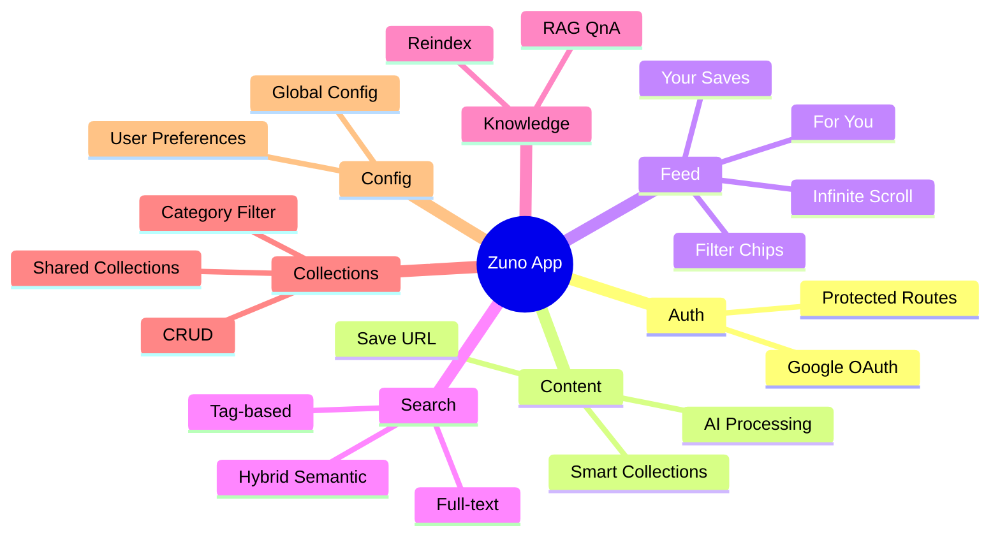

# Zuno — Features & Manual Testing Guide

Checklist for testing auth, content, feed, search, collections, config, and backend APIs.

---

## Feature Overview



---

## 1. Authentication

**What:** Google OAuth sign-in via Supabase.

- [ ] Open app, land on splash, auto-navigate to login
- [ ] Tap "Sign in with Google", complete OAuth flow
- [ ] Verify redirect back to app, land on Home tab
- [ ] Check profile shows name and avatar
- [ ] Tap "Sign Out" on Profile, verify redirect to login
- [ ] Reopen app, verify auto-login if session exists

## 2. Home / Collections

**What:** Grid of collections with category filter chips.

- [ ] Home shows collections grid after login
- [ ] Filter chips load dynamically from AI categories
- [ ] Tap a filter chip, collections filter correctly
- [ ] Pull-to-refresh reloads collections
- [ ] Tap a collection card to see items inside

## 3. Save Content

**What:** Save a URL, AI processes it automatically.

- [ ] Tap "+" button in tab bar
- [ ] Enter a URL (e.g. YouTube video or article)
- [ ] Select platform and content type, tap Save
- [ ] Go to Feed > Your Saves, new item appears
- [ ] Wait for AI badge to show "analyzing..."
- [ ] After processing: category, summary, tags appear
- [ ] Smart collection auto-created for the category

## 4. Feed - Your Saves

**What:** Infinite-scroll list of saved content, filtered by type.

- [ ] Navigate to Feed tab, default is "Your Saves"
- [ ] Content cards show thumbnail, title, summary, platform badge
- [ ] Scroll down triggers infinite scroll
- [ ] Pull-to-refresh reloads the feed
- [ ] Tap filter chips (Videos, Articles, etc.), verify filtering
- [ ] Tap a card, navigates to Content Detail
- [ ] Item count shows at top

## 5. Feed - Suggested (For You)

**What:** Content from other users' shared collections, ranked by interest.

- [ ] Tap "For You" toggle pill on Feed screen
- [ ] Header subtitle changes to "For you"
- [ ] Items from OTHER users appear (not your own)
- [ ] Ranked by relevance (matching categories/tags)
- [ ] Your own saved URLs do NOT appear
- [ ] Tap a suggested card: opens URL in browser
- [ ] Pull-to-refresh generates fresh feed
- [ ] Switch back to "Your Saves", shows your content
- [ ] Close/reopen app: feed_type preference persisted

## 6. Content Detail

**What:** Full AI analysis of saved content.

- [ ] From Feed, tap any saved content card
- [ ] Structured content: TL;DR, Key Points, Action Items
- [ ] If AI not processed yet, fallback to ai_summary
- [ ] Platform and content type badges shown
- [ ] Tags shown
- [ ] "Open Original" opens URL in browser

## 7. Collection Detail

**What:** Items within a specific collection.

- [ ] From Home, tap any collection card
- [ ] Header shows collection icon, title, item count
- [ ] Items listed as feed cards
- [ ] Pull-to-refresh reloads items

## 8. Search

**What:** Full-text + semantic hybrid search.

- [ ] Tap search icon in header
- [ ] Popular tags load below search bar
- [ ] Recent searches show (if any)
- [ ] Type query, submit, results show
- [ ] Tap a popular tag, tag-based search works
- [ ] Recent search saved after searching

## 9. Global Config

**What:** Dynamic app config loaded at startup (no auth).

- [ ] Start backend, verify `GET /api/config` returns JSON
- [ ] Response has: feature_flags, content_limits, feed_settings
- [ ] In app, config loads before auth (check console)
- [ ] Change value in backend `app_config.py`, restart
- [ ] Reopen app, new config picked up

## 10. User Preferences

**What:** Per-user config (feed_type) persisted to backend.

- [ ] `GET /api/user-preferences` returns default (feed_type: usersaved)
- [ ] Toggle "For You" on Feed screen
- [ ] `PATCH /api/user-preferences` fires (check network)
- [ ] Close/reopen app, "For You" still selected
- [ ] Switch back to "Your Saves", persists too

## 11. AI Processing Pipeline

**What:** Full pipeline: scrape, categorize, summarize, tag, embed, chunk.

- [ ] Save new URL via `/api/content`
- [ ] Call `POST /api/ai/process-content` with content_id
- [ ] Verify response has category, summary, tags
- [ ] Check content row: ai_category, ai_summary, ai_structured_content updated
- [ ] Check content_tags created
- [ ] Check content_chunks created for RAG
- [ ] Check user_interests updated
- [ ] Check smart collection created/updated

## 12. Knowledge / RAG

**What:** Ask questions about your saved content.

- [ ] Ensure content has been AI-processed (chunks exist)
- [ ] `POST /api/knowledge/ask` with query
- [ ] Response has answer, sources, chunks_used
- [ ] Answer references actual content
- [ ] `GET /api/knowledge/stats`: total_chunks > 0
- [ ] `POST /api/knowledge/reindex`: chunks regenerated

## 13. Theme

**What:** Light / Dark / System toggle.

- [ ] On Profile, tap settings gear
- [ ] Toggle between Light, Dark, System
- [ ] All screens update colors
- [ ] Close/reopen app, theme persisted

## 14. Admin / Cache

**What:** Backend cache and prompt management.

- [ ] `GET /api/admin/cache/stats`: check entry counts
- [ ] `POST /api/admin/cache/bust?pattern=*`: cache cleared
- [ ] `POST /api/admin/prompts/reload`: prompts reloaded

---

## Quick Backend API Test (curl)

```bash
# Health check
curl http://localhost:8000/health

# Global config (no auth)
curl http://localhost:8000/api/config

# With auth (replace TOKEN)
TOKEN="your-jwt-here"

# Profile
curl -H "Authorization: Bearer $TOKEN" http://localhost:8000/api/profile

# User preferences
curl -H "Authorization: Bearer $TOKEN" http://localhost:8000/api/user-preferences

# Content feed
curl -H "Authorization: Bearer $TOKEN" "http://localhost:8000/api/content?limit=5"

# Suggested feed
curl -H "Authorization: Bearer $TOKEN" "http://localhost:8000/api/suggested-feed?limit=5"

# Search
curl -H "Authorization: Bearer $TOKEN" "http://localhost:8000/api/search?q=cooking&limit=5"

# Knowledge ask
curl -X POST -H "Authorization: Bearer $TOKEN" -H "Content-Type: application/json" \
  -d '{"query":"What are my key takeaways?"}' \
  http://localhost:8000/api/knowledge/ask
```
