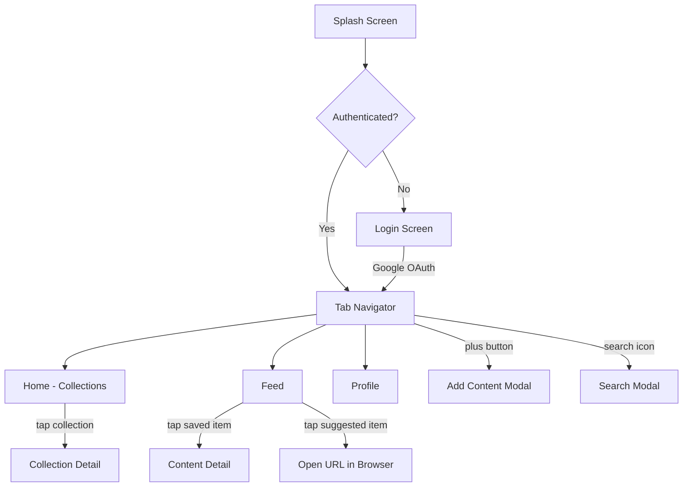
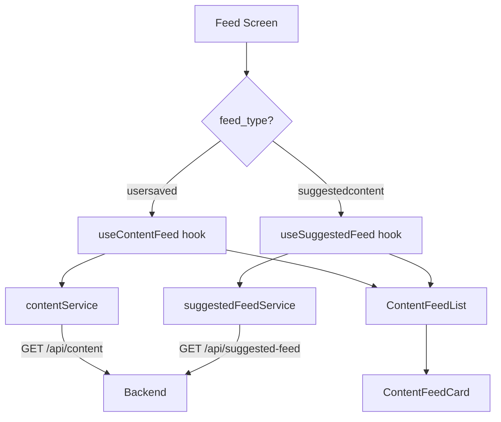
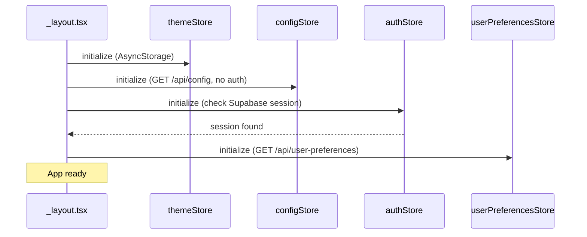

# Zuno Frontend Documentation

**Framework:** React Native (Expo) | **Nav:** Expo Router | **State:** Zustand + React Query | **Styling:** NativeWind | **Auth:** Supabase Google OAuth

---

## Navigation Flow

## Screens

| Screen | Route | Description |
|--------|-------|-------------|
| Splash | `/` | Animated logo, auto-navigate to tabs |
| Login | `/(auth)/login` | Google OAuth sign-in |
| Home | `/(tabs)/` | Collections grid with category filters |
| Feed | `/(tabs)/feed` | Your Saves / For You toggle, infinite scroll |
| Profile | `/(tabs)/profile` | User info, theme toggle, sign out |
| VFeed | `/(tabs)/vfeed` | Placeholder (Phase 6) |
| Add Content | `/add-content` | Save URL with platform and type |
| Search | `/search` | Hybrid search + tags + recent |
| Collection Detail | `/collection/[id]` | Items in collection, themed header |
| Content Detail | `/content/[id]` | AI analysis (TLDR, key points, actions) |

---

## Feed Architecture

---

## State Management

### Zustand Stores

| Store | Key State | Purpose |
|-------|-----------|---------|
| `authStore` | session, user, profile, isAuthenticated | Auth state + profile |
| `themeStore` | mode, isDark | Light / dark / system theme |
| `configStore` | config, isLoaded | Global app config from backend |
| `userPreferencesStore` | feedType, isLoaded | Per-user preferences (feed_type) |
| `contentStore` | activeFilter | Active filter chip on home |

### React Query Keys

| Query Key | Service | Purpose |
|-----------|---------|---------|
| `collections` | collectionsService | Home page collections |
| `categories` | collectionsService | Filter chip categories |
| `contentFeed` | contentService | User saved content feed |
| `suggestedFeed` | suggestedFeedService | Suggested content feed |
| `search` | searchService | Search results |
| `popularTags` | searchService | Popular tags |

---

## App Startup Sequence

---

## Components

### Common

| Component | Purpose |
|-----------|---------|
| `Header` | App header with avatar, title, action buttons |
| `FilterChips` | Horizontal scrollable filter pills |
| `SearchBar` | Search input with clear button |
| `SettingsDropdown` | Theme toggle + account link |
| `PrimaryButton` | Primary action button |
| `Avatar` | Gradient avatar with initials |
| `ThemeToggle` | Light / Dark / System selector |
| `AIProcessingBadge` | Animated badge showing AI status |

### Feed

| Component | Purpose |
|-----------|---------|
| `ContentFeedList` | Infinite scroll FlatList |
| `ContentFeedCard` | Rich card: thumbnail, badges, title, summary |
| `FeedCard` | Generic card for collection detail |
| `PlatformBadge` | Platform icon + brand color |
| `ContentTypeBadge` | Content type label + color |
| `FeedSkeleton` | Loading placeholder cards |

### Home

| Component | Purpose |
|-----------|---------|
| `CollectionsGrid` | 2-column grid of collection cards |
| `CollectionCard` | Themed card with icon, title, count |
| `CollectionSummary` | Total collections + items summary |
| `HomeSkeleton` | Loading placeholder |

---

## Services

| Service | Endpoints Called |
|---------|----------------|
| `authService` | Supabase Auth + `/api/profile` |
| `configService` | `GET /api/config` (no auth) |
| `userPreferencesService` | `GET/PATCH /api/user-preferences` |
| `contentService` | `/api/content` CRUD |
| `collectionsService` | `/api/collections` CRUD + categories |
| `feedService` | `/api/feed` + `/api/bookmarks` |
| `suggestedFeedService` | `GET /api/suggested-feed` |
| `searchService` | `/api/search` + `/api/search/hybrid` + `/api/tags/popular` |

## Hooks

| Hook | Returns | Purpose |
|------|---------|---------|
| `useContentFeed` | InfiniteQuery | User saved content, paginated |
| `useSuggestedFeed` | InfiniteQuery | Suggested content, paginated |
| `useCollections` | Query | Collections with category filter |
| `useCategories` | Query | AI category list |
| `useSearch` | search(), results | Full search functionality |
| `useFeedItems` | Query | Feed items |
| `useBookmarks` | Query + mutation | Bookmark management |
| `useProtectedRoute` | - | Auth redirect guard |

## Key Libraries

| Library | Purpose |
|---------|---------|
| `expo-router` | File-based navigation |
| `@tanstack/react-query` | Server state + caching |
| `zustand` | Global state management |
| `nativewind` | Tailwind CSS for React Native |
| `@supabase/supabase-js` | Auth + realtime |
| `expo-image` | Optimized image loading |
| `lucide-react-native` | Icons |
